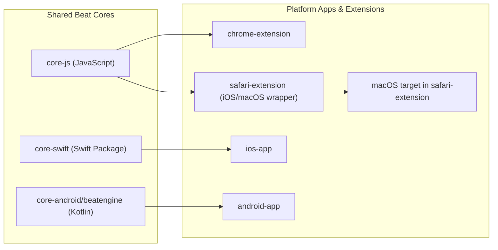

# SonicFlow Monorepo

SonicFlow is a cross-platform audio project that overlays entrainment-style beat layers on user audio across browser, iOS, macOS, and Android surfaces.

Public product name: `SonicFlow`  
Legacy internal codename still present in paths/schemes/packages: `FlowTones`

## Architecture (Visual)



## Repository Structure

```text
soundhealing_sonicflow/
├── docs/
│   ├── architecture/
│   ├── graphics/
│   ├── guides/
│   └── reports/
├── scripts/
├── sonicflow_app/
│   ├── android-app/
│   ├── chrome-extension/
│   ├── core-android/
│   ├── core-js/
│   ├── core-swift/
│   ├── ios-app/
│   └── safari-extension/
├── Makefile
└── README.md
```

## Platform Capability

| Platform | Audio source path | System audio capture |
|---|---|---|
| Chrome extension | Web tab audio via content script + shared JS beat engine | No |
| Safari extension (iOS/macOS) | Web extension runtime audio context | No dedicated system capture path |
| iOS app | Local file + generated beat layer | No |
| macOS app | Local file + generated beat layer | Partial/limited |
| Android app | Local session/service + generated beat layer | No |

## Quick Start

### Prerequisites

- Node.js 22+
- Xcode 17+ (for iOS/macOS/Safari targets)
- Java 17+ and Android SDK API 34 (for Android targets)

### Main Commands

```bash
make help
make chrome
make ios
make mac
make android
make verify
```

`make chrome` copies unpacked extension artifacts to `dist/chrome/`.

## Development Checks

- Full warning audit: `make verify`
- JS core tests: `make test-core-js`
- Swift core tests: `make test-core-swift`
- Chrome extension tests: `make test-chrome`

The warning audit runs cross-platform checks and skips Android only when SDK/Java prerequisites are not configured locally.

## Beat Mode Reference

| Mode | Frequency | Typical intent |
|---|---|---|
| Focus | 40 Hz (gamma) | Concentration |
| Flow | 10 Hz (alpha) | Light productivity |
| Meditation | 6 Hz (theta) | Calm/reflection |
| Sleep | 2 Hz (delta) | Wind-down |

## Documentation Map

- [Architecture details](docs/architecture/system-overview.md)
- [Structure walkthrough](docs/guides/project-structure.md)
- [Team workflow](docs/guides/github-workflow.md)
- [Linear + GitHub process automation](docs/guides/linear-github-process.md)
- [Codex automation prompts/instructions](docs/guides/codex-automation-prompts.md)
- [Historical execution notes](docs/reports/execution-log.md)
- [Current status snapshot](STATUS.md)

## Known Limitations

- iOS and Android targets do not implement Spotify/system-output capture in this repository.
- Safari behavior can differ between iOS Safari and macOS Safari due to Web Extension API differences.
