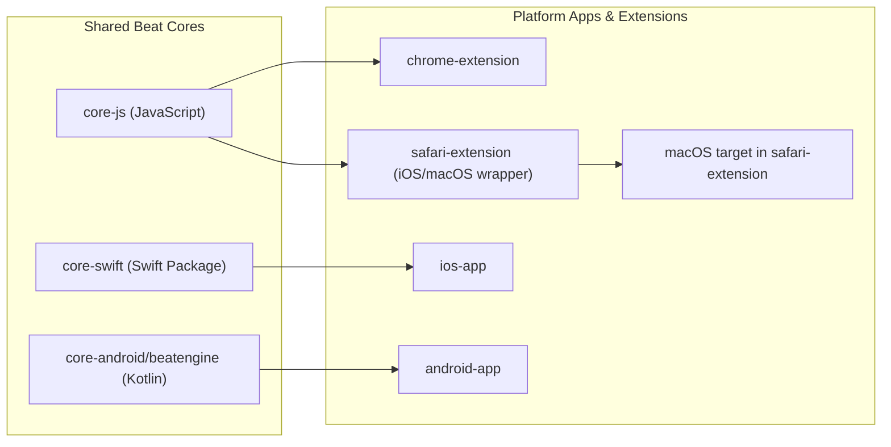

# SonicFlow Monorepo

SonicFlow is a cross-platform audio project that overlays entrainment-style beat layers on user audio across browser, iOS, macOS, and Android surfaces.

Public product name: `SonicFlow`  
Legacy internal codename still present in paths/schemes/packages: `FlowTones`

## FlowTones Runtime Upgrade

SonicFlow is in the middle of adopting the newer standalone `FlowTones` runtime model reviewed from:

- `Sound-Healing-Assistant-iOS/SoundHealingAssistant/Sources/FlowTones`
- upstream module snapshot reviewed at commit `b0cabeed37e06c5ee38b648003f45f9a45f4edd9`

The key runtime concepts now shaping this repo are:

- preset-first sessions
- richer session settings including `durationMinutes`, `ambientMix`, and `pulseDepth`
- ambient-layer and renderer/cache concepts on native platforms where support is real
- FlowTones-style UI direction layered with SonicFlow Leopard branding

## Architecture (Visual)



## Repository Structure

```text
soundhealing_sonicflow/
├── docs/
│   ├── architecture/
│   ├── graphics/
│   ├── guides/
│   └── reports/
├── scripts/
├── sonicflow_app/
│   ├── android-app/
│   ├── chrome-extension/
│   ├── core-android/
│   ├── core-js/
│   ├── core-swift/
│   ├── ios-app/
│   └── safari-extension/
├── Makefile
└── README.md
```

## Platform Capability

| Platform | Runtime/UI status | Audio source path | System audio capture | Notes |
|---|---|---|---|---|
| Chrome extension | FlowTones-style popup with preset-first controls, Overlay Mode, beat volume, duration, ambient mix, pulse depth | Web tab audio via content script + shared JS beat engine | No | Browser-safe overlay for tabs with media elements. No native render/export promises. |
| Safari extension (web shell) | Leopard-backed FlowTones-style wrapper messaging | Web extension runtime shell | No dedicated system capture path | Mirrors product language, but native-only features belong in the app targets. |
| iOS app | Native FlowTones settings model plus upgraded screen state, Overlay Mode status, and advanced controls | Local file + generated beat layer | No | Spotify/YouTube system overlay is unavailable; picked files remain the local overlay path. |
| macOS app | Leopard-native menu-bar popover with starter sessions, Overlay Mode, preset metadata, and advanced controls | Local file/system capture + generated beat layer | Partial/limited | Native app exposes permitted system overlay capture with file fallback. |
| Android app | FlowTones-style session model in ViewModel/service path plus Overlay Mode status and advanced controls in Compose | Local session/service + generated beat layer | No | External app capture needs platform/store policy review; local sessions remain available. |

## Brand Asset Usage

The upgraded FlowTones direction keeps the SonicFlow Leopard identity through shared repo assets:

- Leopard wallpaper source: `brand/assets/wallpapers/leopard_wallpaper.png`
- Singing-bowl hero/icon source: `brand/assets/icons/a_premium_ultra_modern_high_definition_vector_icon_of_a_golden_tibetan_singing_bowl._the_bowl_is_minimalist_with_sleek_sharp_edges_and_a_subtle_metallic_gradient._a_smooth_flowing_and_vibrant_rainbow_energy_swirl_rises_elegantly_from_the_bowl._sev….png`

Usage guidelines in the current rollout:

- native app surfaces should use the Leopard wallpaper as the atmospheric backdrop, cropped as needed
- browser shells should stay visually aligned with Leopard branding without implying native-only capabilities
- the singing-bowl art is intended for hero/icon contexts, not as a substitute for every in-app illustration

## Quick Start

### Prerequisites

- Node.js 22+
- Xcode 17+ (for iOS/macOS/Safari targets)
- Java 17+ and Android SDK API 34 (for Android targets)

### Main Commands

```bash
make help
make chrome
make ios
make mac
make mac-smoke
make android
make test
make verify
```

`make chrome` copies unpacked extension artifacts to `dist/chrome/`.

## Development Checks

- Fast cross-platform unit checks: `make test`
- Full merge gate with warning audit: `make verify`
- JS core tests: `make test-core-js`
- Swift core tests: `make test-core-swift`
- Chrome extension tests: `make test-chrome`
- Android unit tests: `make test-android`
- iOS app tests: `make test-ios`
- Chrome popup upgrade slice: `cd sonicflow_app/chrome-extension && node --test popup.test.js`
- Android session model slice: `cd sonicflow_app/android-app && ./gradlew --console=plain :app:testDebugUnitTest --tests 'com.sonicflow.app.ui.FlowTonesViewModelTest'`
- iOS focused test gate: `make test-ios`
- macOS menu-bar smoke gate: `make mac-smoke`

The warning audit runs cross-platform tests/builds and skips Android only when SDK/Java prerequisites are not configured locally. iOS app tests run when a compatible simulator destination is available.

## Workflow (Linear-First)

1. Move ticket from `Backlog` to `Todo` (manual/explicit).
2. Create branch `feature/TICKET-ID-desc`.
3. Implement and verify (`make test-*`, `make verify`).
4. Open PR with title `[TICKET-ID] ...` and Linear link in PR body.
5. Set PR ready for review -> ticket moves to `Preview` (or `In Review` fallback).
6. Merge path:
   - PR merge -> ticket `Done`
   - ticket `Done` -> automation merges open PR

Parallel work is supported via agents for independent tickets, with one branch/PR per ticket.

## Beat Mode Reference

| Mode | Frequency | Typical intent |
|---|---|---|
| Focus | 40 Hz (gamma) | Concentration |
| Flow | 10 Hz (alpha) | Light productivity |
| Meditation | 6 Hz (theta) | Calm/reflection |
| Sleep | 2 Hz (delta) | Wind-down |

## Documentation Map

- [Architecture details](docs/architecture/system-overview.md)
- [Modulation engine guardrails](docs/architecture/modulation-engine.md)
- [Structure walkthrough](docs/guides/project-structure.md)
- [Team workflow](docs/guides/github-workflow.md)
- [Linear + GitHub process automation](docs/guides/linear-github-process.md)
- [Codex automation prompts/instructions](docs/guides/codex-automation-prompts.md)
- [Brain.fm parity gap audit](docs/competitive/brainfm-parity-gap-audit.md)
- [Historical execution notes](docs/reports/execution-log.md)
- [Current status snapshot](STATUS.md)

## Known Limitations

- iOS and Android targets do not implement Spotify/system-output capture in this repository; their Overlay Mode copy calls out local-session support and policy limits.
- Safari behavior can differ between iOS Safari and macOS Safari due to Web Extension API differences.
- Browser shells expose FlowTones-style controls, but they do not yet offer native offline render/export or cache flows.
- Android currently carries `durationMinutes`, `ambientMix`, and `pulseDepth` through the session model and UI, but the underlying audio engine is not yet feature-parity with the Apple-native runtime.
