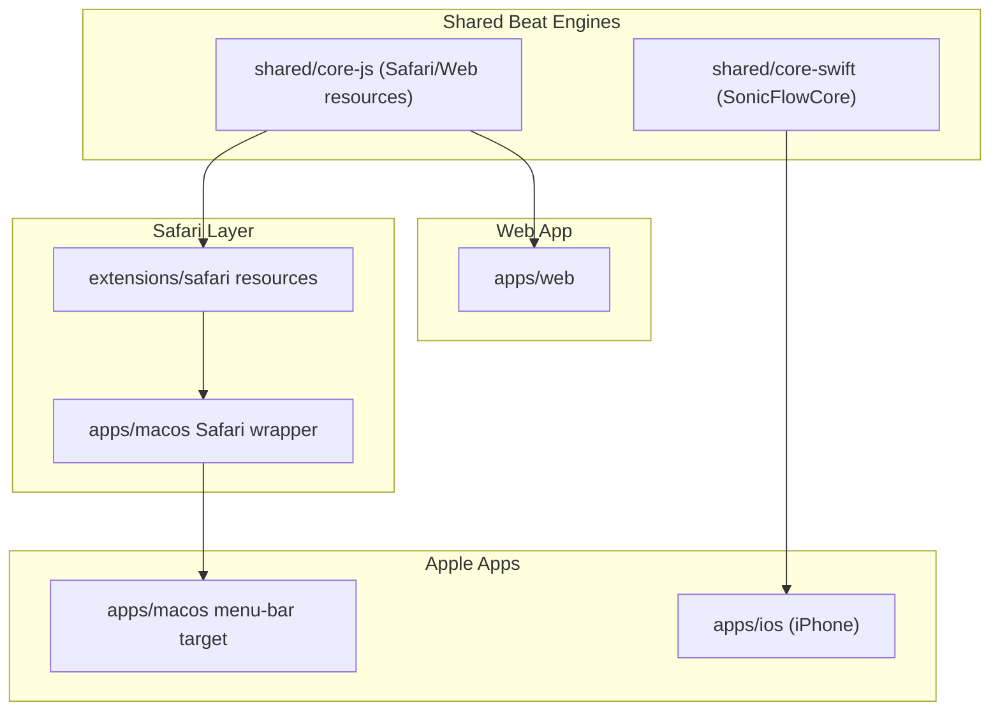
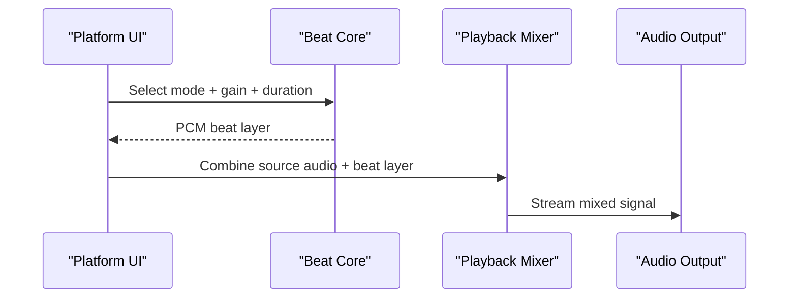

# System Overview

This document explains how shared beat-generation cores map into the active SonicFlow platform runtimes: iPhone, Safari, macOS menu bar, and the web app.

## Component Topology

## Runtime Audio Flow

## Notes

- The JS core is consumed by Safari Web Extension resources and the active Apple-look web app.
- The Swift core powers active native Apple targets.
- Playback and session-control logic remains platform-specific by design.
- Legacy non-Safari browser and non-iOS mobile product code are removed from the active platform tree and excluded from default verification.
- Architecture note: iOS already links `SonicFlowCore`; the macOS menu app still has a local beat-engine fork. The next core cleanup is a shared streaming renderer in `SonicFlowCore` that both iOS and macOS can call from their realtime audio nodes.
