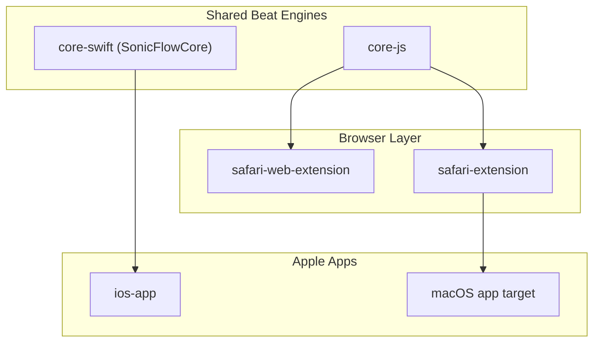
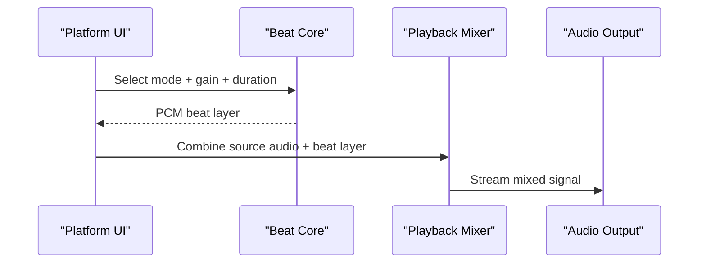

# System Overview

This document explains how shared beat-generation cores map into each SonicFlow platform runtime.

## Component Topology

## Runtime Audio Flow

## Notes

- The JS core is consumed by browser extension surfaces.
- The Swift core mirrors beat mode constants and synthesis shape for Apple-native parity.
- Playback and session-control logic remains platform-specific by design.
